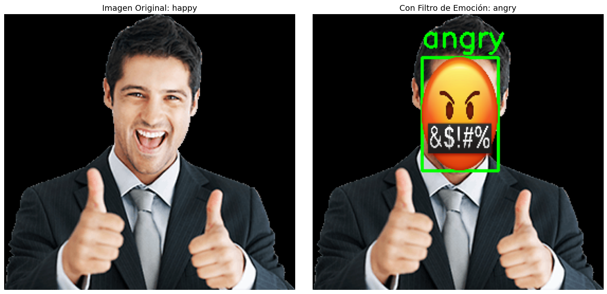
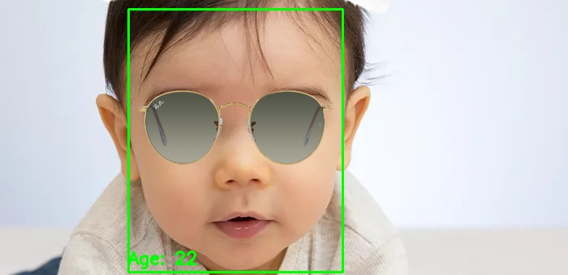
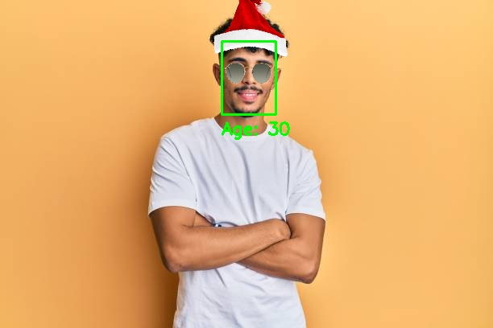
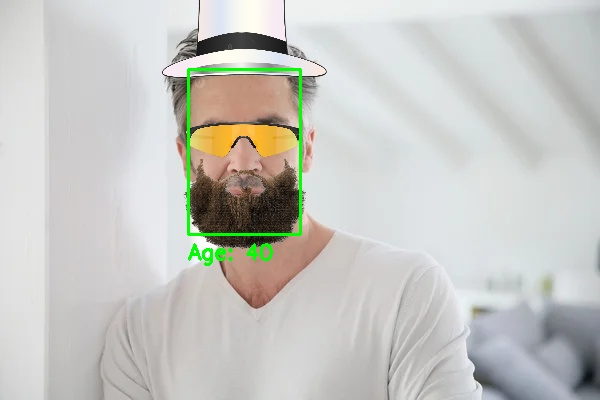

# Práctica 5: Detección y caracterización de caras

## Requisitos de ejecución

Para ejecutar correctamente el cuaderno principal (ENTREGA.ipynb), es necesario contar con lo siguiente:

### Librerías de Python

Instaladas en el *environment* correspondiente:

- `deepface`
- `tensorflow` (Permite utilizar la GPU)
- `opencv-python`
- `numpy`
- `scikit-learn` (`sklearn`)
- `joblib`
- `tqdm`
- `matplotlib`
- `Pillow` (`PIL`)

## Lista y descripción de tareas realizadas

### Objetivo

El objetivo de esta práctica es desarrollar un prototipo que:

1. **Entrene un modelo de reconocimiento de emociones faciales** a partir de un dataset de imágenes, utilizando embeddings faciales.
2. **Implemente un filtro basado en emociones**, añadiendo un emoji sobre la cara según la emoción detectada:
3. **Implemente un segundo filtro basado en la edad estimada**, añadiendo distintos accesorios (sombrero, gafas, barba/bigote) dependiendo del rango de edad de la persona detectada.

En los siguientes GIFs se puede ver el prototipo en funcionamiento:

  

Filtro de emociones con emojis sobre la cara según la emoción detectada.

  

Filtro por edad con accesorios superpuestos (gorros, gafas, bigote).

### Obtención y uso del dataset de emociones

Se parte del dataset obtenido en [kaggle](https://www.kaggle.com/datasets/ananthu017/emotion-detection-fer), únicamente utilizamos las imagenes de la carpeta test, dicha carpeta se organizaba en las siguientes
subcarpetas, una por cada emoción:
  - `angry`, `disgusted`, `fearful`, `happy`, `neutral`, `sad`, `surprised`.

En el cuaderno:

1. Se recorre cada carpeta de clase y se recopilan todas las rutas de imagen.
2. Para cada imagen, se **extrae un embedding facial** utilizando `DeepFace.represent`:
   - Modelo de embeddings: `VGG-Face`.
   - Detector de caras: `retinaface`.
3. Se manejan distintos formatos de salida de `DeepFace.represent` (lista de diccionarios, lista de vectores, etc.) para garantizar compatibilidad.
4. Se construyen:
   - `X`: matriz de embeddings (características).
   - `Y`: etiquetas de clase, posteriormente codificadas con `LabelEncoder`.

El resultado es un conjunto de datos listo para entrenamiento, con varias muestras distribuidas en las 7 emociones.

### Entrenamiento del modelo de reconocimiento de emociones

El entrenamiento se realiza en el primer bloque de código del cuaderno.

#### Configuración global

- `EMBEDDING_MODEL = "VGG-Face"`
- `DETECTOR_BACKEND = "retinaface"`
- Número de folds para validación cruzada estratificada:
  - `K_FOLDS = 5`

Se comprueba la disponibilidad de GPU a través de TensorFlow y se mantiene la posibilidad de ejecución en CPU en caso de no disponer de ella.

#### Validación cruzada (Stratified K-Fold) y búsqueda de hiperparámetros

La función de entrenamiento:

1. Aplica **validación cruzada estratificada** (`StratifiedKFold` con `k=5`), manteniendo el equilibrio de clases en cada fold.
2. En cada fold:
   - Normaliza las características con `MinMaxScaler`.
   - Entrena un **SVM con kernel RBF** (`SVC`) y `class_weight='balanced'` para compensar el desbalanceo de clases.
   - Realiza una búsqueda en rejilla (`GridSearchCV`) sobre los hiperparámetros:
     - `C` en `[1e3, 5e3, 1e4]`
     - `gamma` en `[0.0001, 0.001, 0.01]`
3. Evalúa el rendimiento con:
   - `precision`, `recall`, `f1-score` por clase.

Con una **exactitud global** de alrededor del 53% y medias:

- **Mean Precision:** 0.530  
- **Mean Recall:** 0.524  

#### Entrenamiento final y guardado del modelo

Tras la validación cruzada:

1. Se ajusta un nuevo `MinMaxScaler` utilizando **todos los datos**.
2. Se reentrena el mejor modelo SVM con la totalidad del conjunto de embeddings.
3. Se guardan los objetos necesarios para su uso posterior:
   - `svm_expression_model.pkl`
   - `scaler_expression.pkl`
   - `label_encoder_expression.pkl`

Estos ficheros son cargados posteriormente por los filtros.

## Resultados del entrenamiento

Del proceso de validación cruzada y los informes de clasificación generados en el cuaderno, se obtienen los siguientes resultados globales:

- **Exactitud global** (accuracy) en torno a **0.53**.
- **Media de precisión (Mean Precision):** 0.530  
- **Media de recall (Mean Recall):** 0.524  

Por emociones:

- `happy` es la emoción mejor reconocida, con una precisión de alrededor de 0.81 y un f1-score de ~0.75.
- `angry`, `neutral`, `sad` y `surprised` obtienen resultados intermedios (f1-score entre 0.45 y 0.66).
- `disgusted` y `fearful` presentan peores métricas, algo esperable debido al menor número de muestras y a la mayor ambigüedad visual de estas emociones.

En general, el modelo ofrece un rendimiento razonable para un problema multiclase con 7 categorías y clases desbalanceadas, siendo suficiente para alimentar el filtro desarrollado en la práctica.

### Implementación del primer filtro: emojis según la emoción

El primer filtro añade un **emoji sobre la cara** dependiendo de la emoción detectada.

#### Filtro en tiempo real (webcam)

En el segundo bloque del cuaderno:

1. Se cargan los modelos entrenados:
   - `svm_expression_model.pkl`
   - `scaler_expression.pkl`
   - `label_encoder_expression.pkl`
2. Se cargan los emojis desde:
   - `./images/emojis/`
3. Se abre la cámara (`cv2.VideoCapture(0)`), y para cada frame:
   - Se detectan las caras con `DeepFace.extract_faces` (`retinaface`).
   - Para cada cara:
     - Se extrae el recorte facial.
     - Se obtiene el embedding con `DeepFace.represent`.
     - Se normaliza con el `scaler` cargado.
     - Se predice la emoción con el SVM que entrenamos en el punto anterior.
   - Se dibuja la etiqueta de la emoción sobre la caja.
   - Se redimensiona el emoji correspondiente al tamaño de la cara y se superpone usando el canal alfa para mantener la transparencia.
4. Se muestra la ventana `"Filtro de emociones con emoticonos"` y se registra cada frame en una lista.
5. Al finalizar, se genera el GIF:
   - `./emotions.gif`

#### Filtro sobre imágenes estáticas

En el tercer bloque del cuaderno se aplica el mismo filtro sobre las imágenes de prueba en:

- `./images/emoji-test/`

Para realizar una comparativa de la predicción del módelo respecto a las diferentes emociones.
  

Para cada imagen:

1. Se ejecuta la función `apply_emotion_filter`.
2. Se obtiene una imagen comparativa y la imagen con el emoji sobre la cara.
3. Se guardan los resultados en:
   - `./images/results/emoji/`

Ejemplo de resultado guardado:

  
Resultado del filtro de emociones aplicado sobre `images/emoji-test/happy-person.png`.

Como se puede ver en la imagen, el modelo tiene bastante margen de mejora, aunque no es de extrañar debido a que el modelo tiene una precisión del 53%.

### Implementación del segundo filtro: accesorios según edad

El segundo filtro se basa en la estimación de la edad con `DeepFace.analyze` y aplica distintos accesorios sobre el rostro, según el rango de edad.

#### Recursos de imagen

Se cargan los accesorios desde la siguiente ruta:
- `./images/second-filter-images/`
  
Además, se usan las siguientes imagenes de prueba:

- `./images/second-filter-images/test_kid.png`
- `./images/second-filter-images/test_young.png`
- `./images/second-filter-images/test_old.jpg`

#### Lógica del filtro

La función principal:

1. Llama a `DeepFace.analyze` sobre cada frame o imagen con:
   - `actions=['age']`
   - `detector_backend = "retinaface"` (Tenemos 3 opciones seleccionables, "opencv", "retinaface", "ssd")
   - `enforce_detection=False` para evitar errores si alguna cara no se detecta.
2. Para cada rostro detectado obtiene:
   - Región de la cara (`x`, `y`, `w`, `h`).
   - Edad estimada (`age`).
3. En función de la edad estimada:
   - **Niños (age < 12)**:
     - Se superpone un gorro  (`kidhat.png`) sobre la cabeza.
   - **Jóvenes (age ≤ 30)**:
     - Se añaden gafas (`young_glasses.png`) en la zona de los ojos.
     - Se coloca un sombrero  (`young_Hat.png`) sobre la parte superior de la cabeza.
   - **Mayores (age > 30)**:
     - Se añaden gafas (`older_glasses.png`).
     - Se superpone una barba (`mustache.png`) en la zona inferior de la cara.
     - Se añade un sombrero (`old_Hat.png`).

#### Versión en tiempo real y resultados

- Se abre la webcam y se aplica `apply_age_filter` a cada frame.
- Se van acumulando los frames en una lista y, al finalizar, se guarda el GIF:
  - `./filtro_edad_output.gif`

Además, se procesan las imágenes de prueba (`test_kid`, `test_young`, `test_old`) y se guardan los resultados en:

- `./images/results/output_kid_filtered.jpg`
- `./images/results/output_young_filtered.jpg`
- `./images/results/output_old_filtered.jpg`

Ejemplos de resultados finales:

  
Filtro aplicado a un niño, como falla y piensa que tiene 22 años, le aplica los accesorios de la categoría joven.

  
Filtro aplicado a una persona joven, con gafas y sombrero.

  
Filtro aplicado a una persona mayor de 30 años, con gafas, bigote y sombrero.

## Conclusiones

- El uso de **DeepFace + VGG-Face** como extractor de características permite entrenar un modelo de clasificación (SVM) sin necesidad de entrenar desde cero una red profunda completa.
- La **validación cruzada estratificada** permite evaluar de forma más robusta el modelo, especialmente en presencia de clases desbalanceadas.
- Las emociones más representadas en el dataset (`angry`,`happy`, `neutral`, `sad`) se reconocen mejor, mientras que emociones minoritarias (`disgusted`, `fearful`) presentan métricas más bajas.
- El **primer filtro** demuestra la viabilidad de integrar:
  - Detección de caras.
  - Extracción de embeddings.
  - Clasificación de la emoción.
  - Visualización amigable con emojis superpuestos en tiempo real.
- El **segundo filtro** muestra cómo combinar análisis de edad con gráficos:
  - Aunque la estimación de edad no es perfecta, es suficiente para categorizar en rangos (joven, mayor de 30 años), en el caso de niños fue inviable obtener un resultado, aunque se probaron varias imagenes como test.
  - El posicionamiento de accesorios (sombrero, gafas, bigote) funciona de forma razonable siempre que la detección de cara sea correcta.

## Autoría

- Tycho Quintana Santana.  
- Ian Samuel Trujillo Gil.  

## Uso de IA

- Se ha utilizado IA como apoyo crear la estructura de este archivo `README.md`, aunque se ha revisado meticulosamente con la práctica.
- Se ha utilizado para resolver errores con las importaciones de librerías para los entornos de Conda.  

